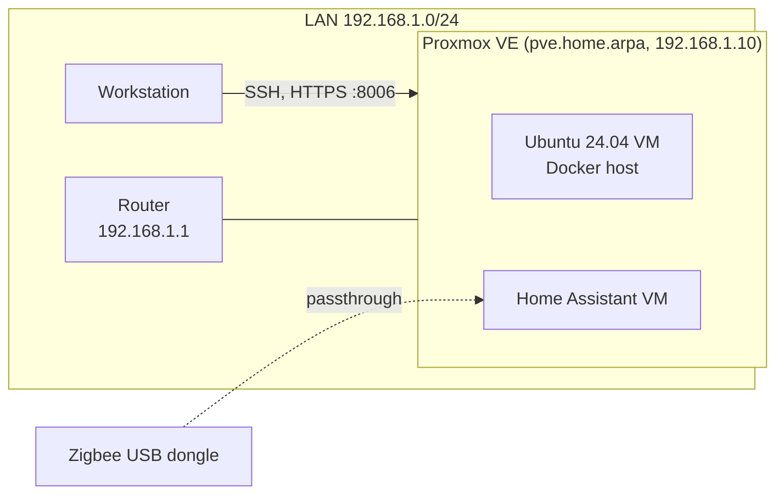

# homelab

Configuration and notes for my home server. It runs Proxmox VE on a small HP
desktop and hosts DNS, smart home and monitoring services for my home network.

I manage it the way I would manage a server at work: changes go through Git,
setup is automated with Ansible where possible, and each stage is written up
in `docs/`.

## Architecture



The Home Assistant VM is not built yet.

## Hardware

| Component | Model |
|-----------|-------|
| Host | HP EliteDesk 705 G4 35W |
| CPU | AMD PRO A10-9700E (4 cores) |
| RAM | 16 GB |
| Storage | Samsung 512 GB NVMe SSD |
| Network | 1 GbE |
| Zigbee | SONOFF Dongle Lite MG21 |

## Status

| Area | Tooling | State |
|------|---------|-------|
| Hypervisor | Proxmox VE 9 | done |
| Remote access | OpenSSH, key-only | done |
| Configuration management | Ansible | in progress |
| Containers | Docker Engine, Compose | in progress |
| DNS and ad blocking | AdGuard Home | not started |
| Reverse proxy | Nginx Proxy Manager or Traefik | not started |
| Monitoring | Prometheus, Node Exporter, Grafana | not started |
| Smart home | Home Assistant, Zigbee | not started |

## Layout

```
docs/      build notes, one file per stage
ansible/   inventory and playbooks
compose/   Docker Compose stacks
```

## Docs

1. [Proxmox host: install, updates, SSH](docs/01-proxmox-host.md)
2. [VM template, Docker host and Ansible](docs/02-vms-and-ansible.md)

## Decisions

**Proxmox instead of Ubuntu on bare metal.** VMs can be snapshotted before
risky changes and rebuilt from scratch, and the Zigbee dongle can be passed
through to the one VM that needs it.

**ext4 with LVM-thin instead of ZFS.** There is only one disk, so ZFS would not
add redundancy, and its ARC cache would take memory the VMs need.

**`home.arpa` as the local domain.** RFC 8375 reserves it for home networks.
`.local` is used by mDNS and causes name resolution conflicts.

**SSH settings in a drop-in file.** `/etc/ssh/sshd_config.d/10-hardening.conf`
is not overwritten by package upgrades and is easy to manage with Ansible.

## Security

- SSH accepts public keys only. Root can log in with a key but not a password.
- Secrets are kept out of the repository (Ansible Vault or ignored `.env` files).
- Only private LAN addresses are published here.

## License

MIT
