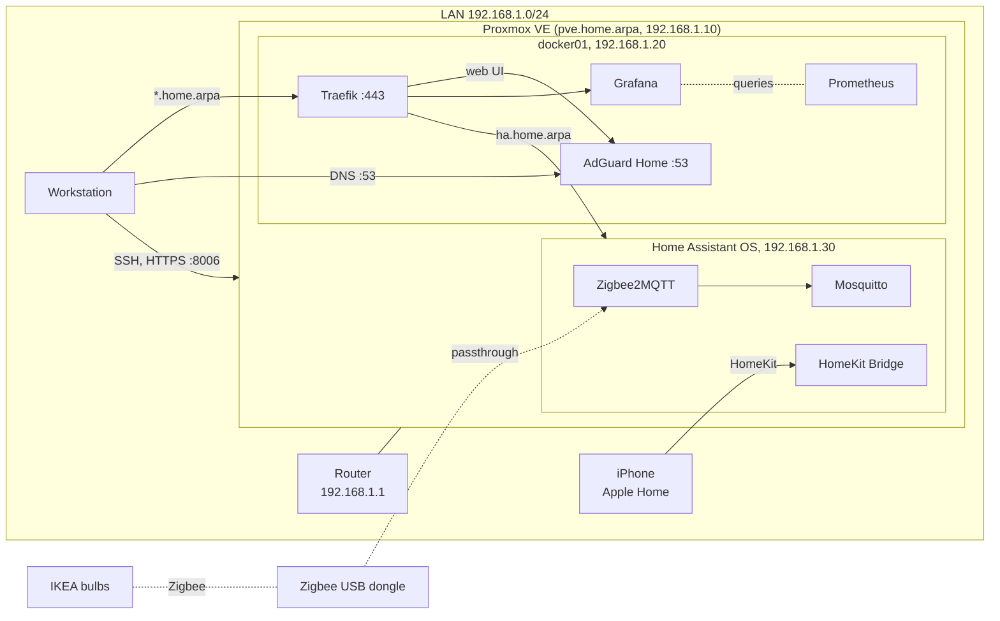

# homelab

Configuration and notes for my home server. It runs Proxmox VE on a small HP
desktop and hosts DNS, smart home and monitoring services for my home network.

I manage it the way I would manage a server at work: changes go through Git,
setup is automated with Ansible where possible, and each stage is written up
in `docs/`.

## Architecture



## Hardware

| Component | Model |
|-----------|-------|
| Host | HP EliteDesk 705 G4 35W |
| CPU | AMD PRO A10-9700E (4 cores) |
| RAM | 16 GB |
| Storage | Samsung 512 GB NVMe SSD |
| Network | 1 GbE |
| Zigbee | SONOFF Dongle Lite MG21 (EmberZNet firmware) |

## Status

| Area | Tooling | State |
|------|---------|-------|
| Hypervisor | Proxmox VE 9 | done |
| Remote access | OpenSSH, key-only | done |
| Configuration management | Ansible | in progress |
| Containers | Docker Engine, Compose | done |
| DNS and ad blocking | AdGuard Home | done |
| Reverse proxy | Traefik, HTTPS with a local CA | done |
| Monitoring | Prometheus, Node Exporter, Grafana | done |
| Smart home | Home Assistant, Zigbee2MQTT | in progress (lights done) |

## Layout

```
docs/      build notes, one file per stage
ansible/   inventory and playbooks
compose/   Docker Compose stacks
```

## Docs

1. [Proxmox host: install, updates, SSH](docs/01-proxmox-host.md)
2. [VM template, Docker host and Ansible](docs/02-vms-and-ansible.md)
3. [DNS and reverse proxy](docs/03-dns-and-reverse-proxy.md)
4. [Home Assistant and Zigbee](docs/04-home-assistant-and-zigbee.md)
5. [Monitoring](docs/05-monitoring.md)

## Decisions

**Proxmox instead of Ubuntu on bare metal.** VMs can be snapshotted before
risky changes and rebuilt from scratch, and the Zigbee dongle can be passed
through to the one VM that needs it.

**ext4 with LVM-thin instead of ZFS.** There is only one disk, so ZFS would not
add redundancy, and its ARC cache would take memory the VMs need.

**`home.arpa` as the local domain.** RFC 8375 reserves it for home networks.
`.local` is used by mDNS and causes name resolution conflicts.

**Traefik instead of Nginx Proxy Manager.** Routes are Docker labels in the
compose files, so they are in Git and deployed by Ansible. Nginx Proxy Manager
keeps its configuration in a database that is edited through a web interface.

**A local CA for HTTPS.** Public CAs do not issue certificates for
`home.arpa`. A CA made with `mkcert` costs nothing and keeps everything on the
LAN. The trade-off is installing the root certificate on each device.

**Home Assistant OS in a VM.** The container version of Home Assistant has no
add-ons and no built-in backups. A VM can be snapshotted before upgrades, and
the Zigbee dongle is passed through to it alone.

**Zigbee instead of Thread for the lights.** The bulbs support both. Thread
with the MG21 as a radio kept failing with transmit timeouts, a known problem
with this chip and IKEA devices, so the dongle runs Zigbee firmware. Details
are in [04](docs/04-home-assistant-and-zigbee.md).

**Zigbee2MQTT instead of ZHA.** Wider device support, and the Zigbee network
is separate from Home Assistant behind MQTT.

**A fallback DNS server for Home Assistant only.** The lights should not stop
working while docker01 is being upgraded.

**IPv6 turned off on the LAN.** The ISP router advertises itself as the IPv6
DNS server and cannot be told otherwise, so clients bypassed AdGuard. With a
public IPv4 address and nothing exposed to the internet, IPv6 was not adding
anything.

**Node Exporter as a system package.** It should see the host directly, and
the Proxmox host does not run Docker.

**Grafana dashboards provisioned from Git.** The data source and dashboard are
files loaded on startup, so a rebuilt VM gets the same dashboard without any
clicking. Dashboards are read-only in the UI for the same reason.

**SSH settings in a drop-in file.** `/etc/ssh/sshd_config.d/10-hardening.conf`
is not overwritten by package upgrades and is easy to manage with Ansible.

## Security

- SSH accepts public keys only. Root can log in with a key but not a password.
- Secrets are kept out of the repository (Ansible Vault or ignored `.env` files).
- TLS keys live outside the repository and are copied to the server by Ansible.
- Zigbee network keys stay in Home Assistant and its backups.
- Only private LAN addresses are published here.

## License

MIT
