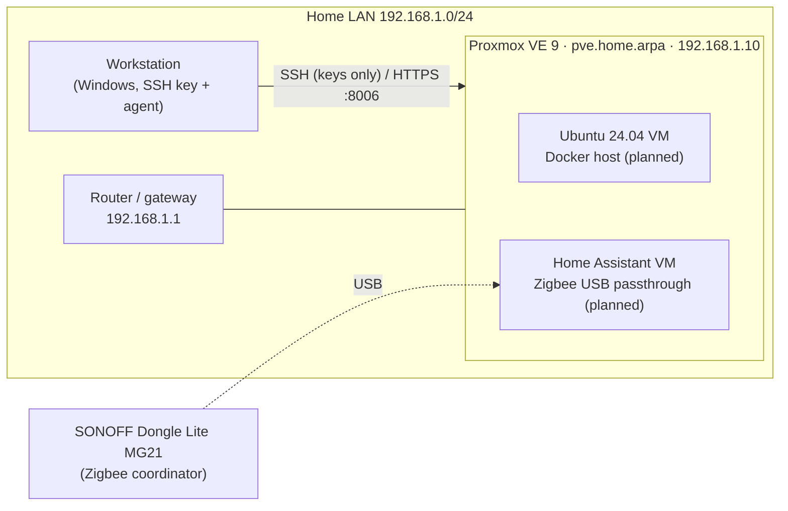

# homelab

IaC-driven homelab on a single bare-metal Proxmox VE node. Every layer, from host
hardening to containers and monitoring, is documented and reproducible from this
repository.

> Goal: run real home services (DNS, smart home, monitoring) on infrastructure
> managed like production: version-controlled config, automation over manual
> changes, least-privilege access and observability.

## Architecture



## Hardware

| Component | Spec |
|-----------|------|
| Host | HP EliteDesk 705 G4 35W (mini) |
| CPU | AMD PRO A10-9700E, 4C/4T |
| RAM | 16 GB |
| Storage | 512 GB Samsung NVMe SSD |
| Network | 1 GbE (Realtek) |
| Zigbee | SONOFF Dongle Lite MG21 (EFR32MG21) |

## Tech stack

| Layer | Tool | Status |
|-------|------|--------|
| Hypervisor | Proxmox VE 9 (KVM, ext4 + LVM-thin) | ✅ Done |
| Access | OpenSSH, Ed25519 keys, password auth disabled | ✅ Done |
| Configuration management | Ansible | ⏳ Planned |
| Containers | Docker, Docker Compose | ⏳ Planned |
| DNS / ad blocking | AdGuard Home | ⏳ Planned |
| Reverse proxy | Nginx Proxy Manager or Traefik | ⏳ Planned |
| Monitoring | Prometheus, Node Exporter, Grafana | ⏳ Planned |
| Smart home | Home Assistant + Zigbee | ⏳ Planned |

## Repository structure

```
.
├── docs/        # Step-by-step build log, one file per stage
├── ansible/     # Inventory, playbooks and roles (stage 3)
└── compose/     # Docker Compose stacks (stage 4-5)
```

## Build log

1. [Proxmox VE host: install, updates, SSH hardening](docs/01-proxmox-host.md)

## Key design decisions

| Decision | Why |
|----------|-----|
| Proxmox VE instead of bare-metal Ubuntu | Snapshots, isolated VMs per role, fast rebuilds, USB passthrough for Zigbee |
| ext4 + LVM-thin instead of ZFS | Single disk gives no ZFS redundancy; ARC would compete with VMs for 16 GB RAM |
| `home.arpa` instead of `.local` | RFC 8375 reserves `home.arpa` for home networks; `.local` collides with mDNS |
| Static IP for the host | Web UI, SSH and Ansible inventory need a stable address |
| SSH drop-in config (`sshd_config.d/`) | Survives package upgrades and is easy to manage with Ansible later |

## Security

- SSH: public-key authentication only, root limited to `prohibit-password`.
- Private keys are passphrase-protected and loaded through `ssh-agent`.
- No secrets are committed: credentials live in Ansible Vault or git-ignored `.env` files.
- Only private RFC 1918 addresses appear in this repo; no public IPs, serials or MAC addresses.

## Roadmap

- [x] Stage 1: Proxmox host, networking, SSH key access
- [ ] Stage 2: Repository and documentation structure
- [ ] Stage 3: Ansible (updates, packages, UFW)
- [ ] Stage 4: Docker + AdGuard Home + reverse proxy with local domains
- [ ] Stage 5: Prometheus + Grafana + Node Exporter
- [ ] Zigbee: Home Assistant VM with USB passthrough

## License

[MIT](LICENSE)
